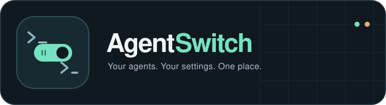

<p align="center">
  
</p>

<h1 align="center">AgentSwitch</h1>

<p align="center">
  A native desktop manager for your AI coding agents.<br>
  Toggle configuration, compare workspaces, and browse chat histories without hand-editing provider files.
</p>

<p align="center">
  <a href="https://github.com/RoyCoding8/AgentSwitch/actions/workflows/ci.yml"></a>
  <a href="https://github.com/RoyCoding8/AgentSwitch/releases"></a>
  <a href="#build-from-source"></a>
  <a href="LICENSE"></a>
</p>

<p align="center">
  <a href="https://github.com/RoyCoding8/AgentSwitch/releases"></a>
</p>

<p align="center">
  <a href="#features">Features</a> &nbsp;·&nbsp;
  <a href="#install">Install</a> &nbsp;·&nbsp;
  <a href="#supported-providers">Providers</a> &nbsp;·&nbsp;
  <a href="#usage">Usage</a> &nbsp;·&nbsp;
  <a href="#build-from-source">Build from source</a>
</p>

## Features

| Configure | Inspect | Manage chats |
|---|---|---|
| Toggle skills, hooks, rules, and MCP servers individually or in bulk. | Compare project and global configuration with secret-safe fingerprints. | Search conversations across supported providers. |
| Switch between project and global scopes with the workspace browser. | Find duplicates, missing targets, and scope conflicts in **Diff**. | Export JSON or ZIP archives and import supported conversations. |
| Edit instructions and rules with stale-edit detection and atomic saves. | Examine hook events, matchers, timeouts, and overlaps in **Hooks**. | Convert supported conversations and restore sessions from Trash. |

Native Windows, Linux, and macOS builds. Provider-specific toggles preserve TOML comments and formatting, and JSON key order. Bulk actions roll back file and path changes on failure.

> [!IMPORTANT]
> Chat compatibility varies by provider. Native resume is not guaranteed, and exported archives can contain sensitive source events. See the [compatibility notes](#compatibility-notes).

## Install

Download the matching binary from [Releases](https://github.com/RoyCoding8/AgentSwitch/releases). No Rust toolchain is needed to use a prebuilt binary.

| Platform | Release asset |
|---|---|
| Windows x86-64 | `agent-switch-windows-x86_64.exe` |
| Linux x86-64 | `agent-switch-linux-x86_64` |
| macOS Intel | `agent-switch-macos-x86_64` |
| macOS Apple Silicon | `agent-switch-macos-aarch64` |

## Supported providers

Claude Code · Codex CLI · Antigravity · Kiro · OpenCode · ZCode · Junie CLI · Muse Code · Grok Build

> Antigravity (`agy`) is the supported Google CLI. AgentSwitch does not include a separate Gemini CLI provider. Antigravity may still use the documented `GEMINI.md` filename.

<details>
<summary><strong>Provider paths and supported capabilities</strong></summary>

| Provider | Instruction File | Skills | Hooks | MCP | Native Chats |
|---|---|---|---|---|---|
| Claude Code | `CLAUDE.md` | `.claude/skills/` | `.claude/settings*.json` (stash to sidecar) | Project `.mcp.json`; approval lists in settings | Best-effort JSONL (internal format) |
| Codex CLI | `AGENTS.md` | `.codex/skills/`, `.agents/skills/` | `hooks.json` (stash to sidecar); `config.toml` inline hooks read-only | `config.toml` `mcp_servers` | Best-effort JSONL (internal format) |
| Antigravity CLI (`agy`) | `GEMINI.md`, `AGENTS.md` | `.agents/skills/`, global `skills/` | `.agents/hooks.json` (native per-definition `enabled` flag) | `.agents/mcp_config.json` | Not supported by AgentSwitch |
| Kiro | Steering documents | Steering, Specs, Agents | `.kiro/hooks/*.json` (native per-hook `enabled` flag); legacy agent-config hooks stashed | `settings/mcp.json` | JSON + JSONL ACP sessions |
| OpenCode | `AGENTS.md` | `.opencode/skills/` plus `.agents/`/`.claude/` compatibility | Plugins | `opencode.json` | Best-effort SQLite for recognized schemas; native resume compatibility is not guaranteed |
| ZCode | `AGENTS.md` (workspace) / `~/.zcode/AGENTS.md` (user) | `.zcode/skills/`, `.agents/skills/` | `hooks.events` in `.zcode/config.json` / `~/.zcode/cli/config.json` (native per-entry `enabled` flag) | `mcp.servers` in the same configs (fallback `.agents/mcp.json`) | SQLite (`~/.zcode/cli/db/db.sqlite`) |
| Junie CLI (`junie`) | `.junie/AGENTS.md`, root `AGENTS.md`, `.junie/playbook.md`, legacy `.junie/guidelines.md` / `.junie/guidelines/`, `.junie/rules/*.md` | `.junie/skills/`, `.junie/commands/`, `.agents/skills/` | `hooks` in `~/.junie/config.json` only — the CLI ignores project-local hooks by default | `.junie/mcp/mcp.json` (project and user) | Not supported by AgentSwitch |
| Muse Code (`muse`) | root `AGENTS.md`, `.agents/AGENTS.md` | `.agents/skills/` (project), `~/.config/muse/skills/` + `~/.agents/skills/` (user) | `.muse/hooks.json` (project) and `hooks` in `~/.config/muse/settings.json` (user) | `mcp_servers` in `~/.config/muse/settings.json` | JSONL event journal (`~/.local/share/muse/sessions/`) — browsable and exportable, not a conversion target; paths and event shapes follow AgentSwitch's implementation |
| Grok Build (`grok`) | root `AGENTS.md`, `~/.grok/AGENTS.md`, `.grok/rules/*.md` | `.grok/skills/` | `.grok/hooks/*.json` (project + user, Claude-compatible shape) | `config.toml` `mcp_servers` (project + user) | Session directories (`~/.grok/sessions/`) — browsable and exportable, not a conversion target |

</details>

## Compatibility notes

Database-backed OpenCode and ZCode chats are archived before their rows are deleted. Avoid trashing a session the provider is actively updating. Restore rebuilds supported archived content and reuses the original session ID unless it is already occupied.

<details>
<summary>How hook toggling works per provider</summary>

AgentSwitch stores disabled Claude Code hook entries in a `<config>.agentswitch` sidecar and restores their original positions on re-enable. It also reads older `_agentswitch_disabled` stashes. Codex `hooks.json` uses the same sidecar approach. Antigravity hook definitions and Kiro CLI 3.0 `.kiro/hooks/*.json` files use native `enabled` flags. Legacy Kiro agent-config hooks use sidecars.

AgentSwitch scans Junie hooks only in `~/.junie/config.json`. Junie ignores project-local hooks by default, although explicit CLI configuration can change that behavior. Muse Code and Grok Build hook integrations use matcher/hooks entries and sidecar stashes. Muse vendor compatibility has not been independently verified.

</details>

<details>
<summary>ZCode scope and storage notes</summary>

AgentSwitch reads user configuration from `~/.zcode/cli/config.json` and workspace configuration from `<repo>/.zcode/config.json`. Inspection of the shipped ZCode 3.11.2 code confirms `mcp.servers` in these configurations. AgentSwitch toggles hook entries through `enabled` and disables MCP servers by moving their entries into a sidecar.

[ZCode's hook documentation](https://zcode.z.ai/en/docs/hooks) states that project-level hooks are ignored for security reasons. AgentSwitch can display and edit those entries, but changing their flags does not make ZCode execute them. Use user-level hooks or plugins for execution.

Chat browsing targets ZCode's internal SQLite database at `~/.zcode/cli/db/db.sqlite`. The shipped 3.11.2 schema contains the `session`, `message`, and `part` columns used by AgentSwitch's OpenCode-compatible reader. This establishes structural compatibility, not native import or resume compatibility. ZCode updates may change these internals.

In AgentSwitch, `ZCODE_HOME` overrides the user configuration root and `ZCODE_DB` overrides the chat database path. `ZCODE_HOME` does not relocate AgentSwitch's chat database lookup. These are AgentSwitch overrides, not verified general-purpose ZCode environment-variable contracts.

</details>

<details>
<summary>Chat conversion details</summary>

**Chat conversion** has two workflows:

- Pick a chat and use **Convert…** to write it into a supported destination store.
- Export a chat to JSON or ZIP, use **Convert archive…**, then **Import** the converted file and choose its project folder. The source provider does not need to remain installed.

Conversion synthesizes destination events from AgentSwitch's normalized messages. It does not copy raw events between provider formats or recreate native tool invocations. Tests verify rediscovery and text round-trips through AgentSwitch's readers. Native CLI discovery, rendering, and resume compatibility are not guaranteed.

Codex conversion writes a rollout and a session-index entry. If a `state_N.sqlite` database exists, AgentSwitch also attempts to register the session in its `threads` table. Registration requires a compatible schema.

Tool metadata varies by provider. Summaries can contain field-type summaries, argument strings, or tool results. Timestamps may be absent. Some exported archives retain raw source events, including arguments and outputs. **Archives are not redacted exports.**

Conversion transfers text extracted into `messages` using destination-specific role mappings. Results retained only in tool summaries or raw events do not transfer into native history. Native tool-result replay is not guaranteed.

Antigravity chat browsing and conversion are not implemented. Grok Build and Muse Code are source-only integrations. AgentSwitch reads supported conversation records but has no native session writer for either provider. Grok extraction reads `chat_history.jsonl`, not the `updates.jsonl` resume log.

</details>

## Build from source

`Cargo.toml` declares Rust 1.88. The locked dependencies built and all 151 enabled tests passed with Rust 1.88.0 on Windows GNU. CI uses stable Rust. Other targets have not been tested with Rust 1.88 in this audit. SQLite is bundled via `rusqlite`, so no system SQLite installation is needed.

```bash
git clone https://github.com/RoyCoding8/AgentSwitch.git
cd AgentSwitch
cargo build --release
```

Output binary:

- **Windows:** `target/release/agent-switch.exe`
- **Linux / macOS:** `target/release/agent-switch`

### Linux dependencies

```bash
sudo apt-get update
sudo apt-get install -y \
  pkg-config libgtk-3-dev libx11-dev libxi-dev \
  libxkbcommon-dev libwayland-dev libgl1-mesa-dev libasound2-dev
```

## Usage

Launch AgentSwitch from the workspace you want to inspect, or use **Browse** to pick a workspace at runtime.

| Tab | Purpose |
|---|---|
| **Items** | Toggle discovered provider config items (skills, hooks, rules, MCP servers). |
| **Hooks** | Inspect hook execution order, scope, matcher, handler type, blocking risk, duplicates, and project/global overlaps. |
| **Diff** | Compare project vs global config with stable, secret-redacted fingerprints. |
| **Chats** | Browse, search, export, import, and trash chat sessions across all providers. |

> Diff Workbench and Hook Cockpit are read-only diagnostics. Toggle actions remain in **Items**.


## Architecture

```text
src/
  main.rs          eframe entry point
  app.rs           state machine and UI orchestration
  batch.rs         exact multi-item recovery and rollback
  config_store.rs  atomic writes, backups, and verified moves
  provider.rs      current provider paths, CLI names, and instructions
  types.rs         shared item, provider, and scope types
  scanner.rs       provider filesystem discovery
  toggler.rs       rename and provider-specific structured mutations
  diagnostics.rs   project/global diff workbench engine
  hook_diag.rs     static hook cockpit engine
  chat.rs          chat history scanner, archive, export/import, trash, OpenCode SQLite
  editor.rs        inline markdown editor state
  ui/
    mod.rs         module declarations
    theme.rs       dark theme colors, fonts, and style
    sidebar.rs     provider list and scope tabs
    item_list.rs   toggle list with filter tabs
    diff_panel.rs  diff workbench UI
    hooks_panel.rs hook cockpit UI
    chat_panel.rs  chat manager UI
    editor_panel.rs inline editor UI
    status_bar.rs  bottom status summary
```

## License

Apache 2.0. See [LICENSE](LICENSE).
